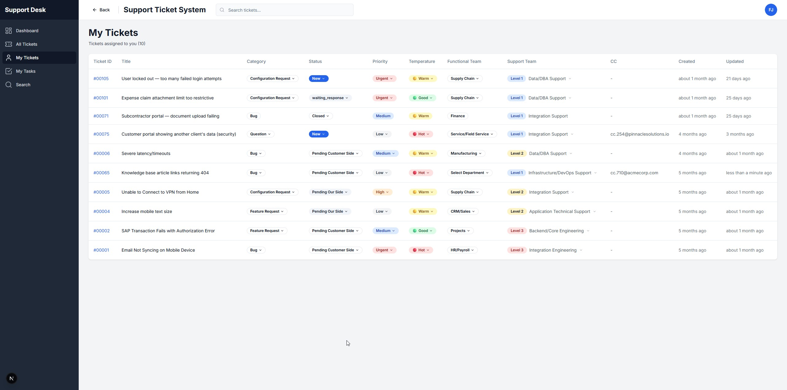

# Support Ticket Management System

> A support operations platform that brings visibility, ownership, and accountability to customer ticket workflows.


---
<p align="center">
  
</p>

---

## Problems This Solves

| Pain Point | Impact |
|---|---|
| **Low visibility** | Leaders can't quickly assess ticket load, risk, or team performance |
| **Slow resolution** | Unclear ownership, missed follow-ups, and messy handoffs slow every cycle |
| **Weak accountability** | No audit trail of what changed, by whom, and when |
| **Fragmented collaboration** | Comments, tasks, and context are scattered across disconnected tools |

---
<p align="center">
  
</p>

---

## Business Value Delivered

- **Faster support operations** — structured ticket-task workflows reduce response and resolution time
- **Safer execution** — role-based access and row-level security patterns protect sensitive data
- **Decision-ready reporting** — dashboard and status tracking enable real-time operational oversight
- **Scalable foundations** — typed architecture and modular components support rapid feature delivery

---

## What I Built

### Core Features
- **End-to-end ticket lifecycle** — create, assign, prioritize, track, and close support tickets
- **Task orchestration** — actionable tasks linked directly to tickets for execution clarity
- **Collaboration layer** — ticket comments and history for cross-team coordination
- **Role-aware platform** — admin, lead, support member, and client access boundaries

### Stack
```
Next.js App Router · Supabase · React Query · Zod · Tailwind CSS
```

---

## Data Model

Core entities are designed around operational flow and accountability:

| Entity | Purpose |
|---|---|
| `profiles` | User identity and role metadata |
| `teams` | Support team ownership model |
| `tickets` | Core support case — status, priority, assignment, and search content |
| `tasks` | Executable work units connected to a ticket |
| `ticket_comments` | Collaboration and context continuity |
| `ticket_history` | Immutable audit trail for compliance and root-cause analysis |
| `integrations` | External system connection points |

**Relationship design:**
```
profiles  (1) → (many)  tickets / tasks
tickets   (1) → (many)  tasks, ticket_comments, ticket_history
teams     (1) → (many)  profiles / tickets
```

> A model that supports **traceability, team ownership, and operational reporting** without sacrificing delivery speed.

---

## What This Demonstrates

This project shows I can:

1. **Turn business pain points into product and data architecture** — starting from real operational problems, not just technical requirements
2. **Build secure and maintainable full-stack systems** — with typed, modular, production-grade code
3. **Ship practical features** — that improve service reliability and team efficiency
