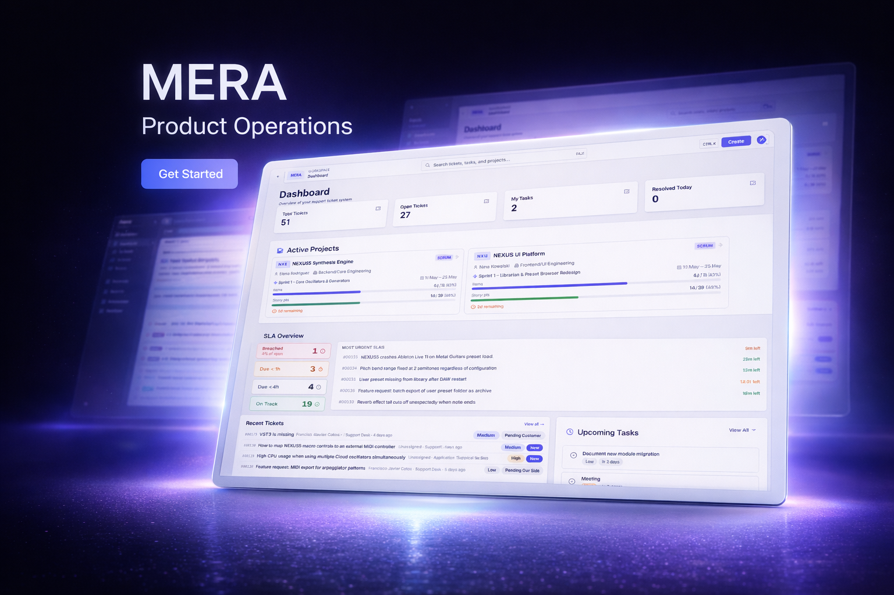
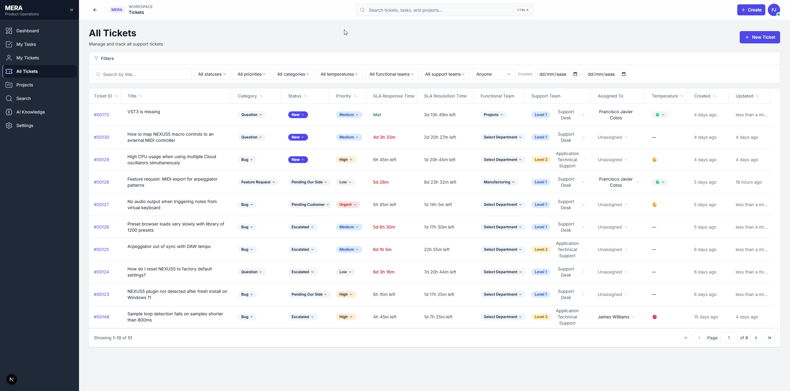
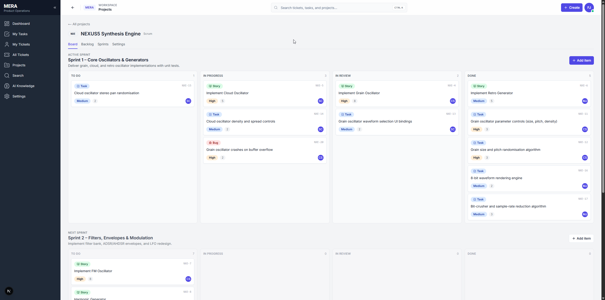
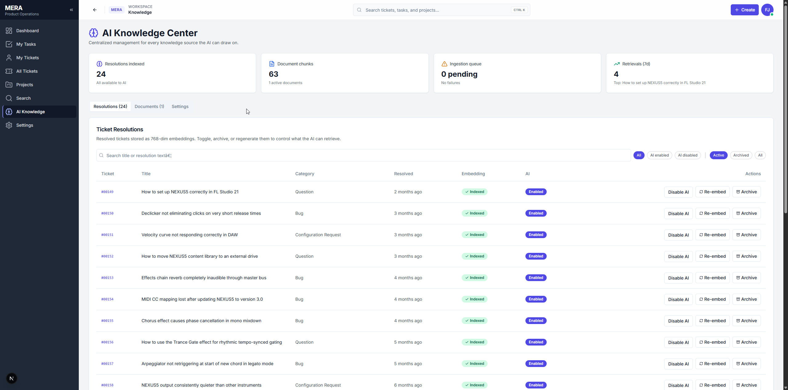
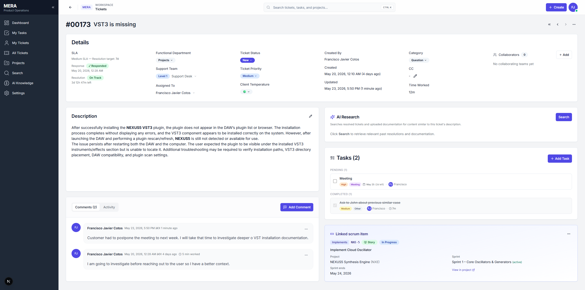
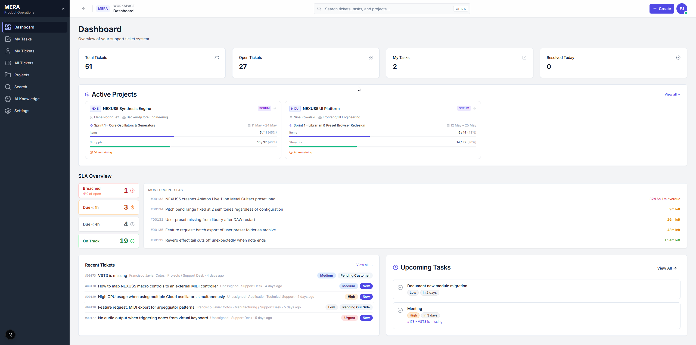

# MERA — Product Operations Platform

> An open-source, AI-native workspace for product ops teams. Tickets, SLAs, knowledge retrieval, and Scrum delivery — unified in a single system where the database is the source of truth.


<p align="center">
  
</p>

---

## What is MERA?

Most ops teams fragment their work across a ticketing tool, a chat thread, a tasks app, a knowledge wiki, and a project tracker nobody updates. Context lives in five places — none authoritative — and SLAs slip while leads spend their day reconstructing what happened.

**MERA closes that gap.** Every closed ticket feeds a searchable knowledge layer. Recurring issues become engineering work items in the same tool. SLAs are computed, not estimated. When an agent opens a new case, an AI Research panel surfaces the most relevant past resolutions and documentation — automatically, with full source attribution.

> The flywheel: every resolved ticket makes the next one cheaper to solve, and patterns become roadmap items without switching tools.

---

## Core Surfaces

| Surface | What it does |
| --- | --- |
| **Tickets** | Full lifecycle — status, priority, temperature, SLA, rich-text resolution, realtime comments, immutable audit trail |
| **SLA Engine** | Per-priority response & resolution policies, auto-assigned on creation, pause/resume on customer-blocked statuses, computed at read time — no cron, no drift |
| **AI Knowledge Center** | Closed tickets + uploaded PDFs chunked and embedded via Gemini. Unified retrieval ranked by similarity, governed by admin-tunable weights and thresholds |
| **Projects & Scrum** | Projects, sprints, work items (epic / story / task / bug), drag-and-drop sprint board, backlog planning — same auth, same teams |
| **Team Management** | Business, support (L1/L2), and engineering squads — CRUD inline, many-to-many membership with roles |
| **Client Companies (CRM)** | Per-client view at `/companies` — contacts, tickets grouped by category, linked project features, and a categorical **health meter** with a full change history. Tickets & projects carry an optional `company_id` |
| **Client Support Portal** | Public, unauthenticated animated hero at `/support` where external clients submit tickets — validates, simulates submission, and tags the payload `source: "client-portal"` to distinguish external from internal requests |

---

## Screenshots

<table>
  <tr>
    <td align="center" width="50%">
      
      <br/><sub><b>Ticket Queue</b> — status, priority, SLA countdown, temperature, team filters</sub>
    </td>
    <td align="center" width="50%">
      
      <br/><sub><b>Scrum Board</b> — sprints, epics, stories, bugs, drag-and-drop kanban</sub>
    </td>
  </tr>
</table>

<br/>

<p align="center">
  
  <br/><sub><b>AI Knowledge Center</b> — every closed ticket auto-indexed as a 768-dim embedding; PDFs chunked and ingested via Gemini edge functions</sub>
</p>

<br/>

<table>
  <tr>
    <td align="center" width="50%">
      
      <br/><sub><b>Ticket Page</b> — full ticket context</sub>
    </td>
    <td align="center" width="50%">
      
      <br/><sub><b>Dashboard</b> — team overview</sub>
    </td>
  </tr>
</table>

---

## AI — First-Class, Not a Feature

**In the product:**
- Every ticket close generates a 768-dim Gemini embedding via `pg_net` → edge function — no manual step, no queue
- An **AI Research panel** embeds the query and runs `match_knowledge()` across ticket resolutions and KB documents in real time
- PDF ingestion: upload → edge function → `unpdf` extraction → chunking → Gemini batch embedding → `pgvector` — fully automated
- Retrieval is governed: similarity threshold, max results, per-source weights, per-document toggle — all admin-configurable, all audited

**In the codebase:**
- Built end-to-end with Claude Code and GitHub Copilot woven into the development workflow
- AI-assisted development is part of the thesis: this is what modern engineering looks like

---

## Architecture

```
┌─────────────────────────────────────────────────────────────────┐
│                       Browser (React 19)                        │
│  Server Components  │  Client Components  │  TanStack Query     │
└────────────┬──────────────────────────┬────────────────────────┘
             │ Server Actions           │ apiBrowser.*
             ▼                          ▼
┌─────────────────────────────────────────────────────────────────┐
│                    Next.js 16 (App Router)                      │
│  Auth only: @supabase/ssr — cookie session, no DB access        │
└──────────────────────────┬──────────────────────────────────────┘
                           │ Authorization: Bearer <jwt>
                           ▼
┌─────────────────────────────────────────────────────────────────┐
│                   Fastify 5 API  (apps/api)                     │
│  JWT validation → per-request Supabase client (RLS preserved)   │
│  Routes: tickets · tasks · projects · sprints · knowledge · …  │
│  OpenAPI docs at :8080/docs · Zod validation on every endpoint  │
└──────────────────────────┬──────────────────────────────────────┘
                           │ user-scoped client (auth.uid() intact)
                           ▼
┌─────────────────────────────────────────────────────────────────┐
│                       Supabase Platform                         │
│  Postgres 15 + RLS + Triggers │ Storage (S3) │ Auth             │
│  pgvector · pg_net → Edge Functions (Deno)                      │
│    embed-resolution · ingest-document · embed-query             │
│         ↓  Google Gemini  gemini-embedding-001  (768 dims)      │
└─────────────────────────────────────────────────────────────────┘
```

**Key decisions:**

| Decision | Why |
| --- | --- |
| **Owned API layer (Fastify)** — web app holds auth cookies only | Supabase is an implementation detail. The API can be versioned, rate-limited, tested, replaced. OpenAPI comes for free |
| **Business logic in Postgres triggers** — history, SLA state, resolution validation | Invariants hold regardless of client. The database is the contract |
| **RLS as the security boundary** | Frontend checks are UX. RLS is the final word — auditable, declarative |
| **SLA status is a pure function** of stored timestamps | Never wrong, never drifts, zero cron overhead |
| **Server Components first** — client islands only where stateful | No waterfall on the client; cheap server data fetches |

> Full endpoint reference — every route, request shape, and error code — in [docs/API_CONTRACTS.md](docs/API_CONTRACTS.md). Live OpenAPI UI at `:8080/docs`.

---

## Stack

| Layer | Technology |
| --- | --- |
| Frontend | **Next.js 16** — App Router, Server Actions, Server Components |
| API | **Fastify 5** — TypeScript strict, Zod validation, OpenAPI at `/docs` |
| UI | **React 19**, **shadcn/ui** + Radix, **Tailwind 3**, **Tiptap v3** |
| Language | **TypeScript 5** strict — `database.types.ts` generated and authoritative |
| Data | **Supabase** — Postgres + Auth + Storage + Edge Functions (Deno) |
| Vector | **pgvector** (768-dim) + **Gemini `gemini-embedding-001`** |
| Forms | **react-hook-form** + **Zod** |
| Client cache | **TanStack Query v5** — optimistic mutations, surgical usage |
| DnD | **@dnd-kit** — accessible drag-and-drop on sprint board |

---

## Quick Start

```bash
# 1. Clone & install
git clone https://github.com/<your-handle>/mera
cd mera && pnpm install   # Node >= 20, pnpm >= 9

# 2. Env — two apps, two files
# apps/web/.env.local   → NEXT_PUBLIC_SUPABASE_URL, NEXT_PUBLIC_SUPABASE_ANON_KEY, API_URL, NEXT_PUBLIC_API_URL
# apps/api/.env.local   → PORT=8080, SUPABASE_URL, SUPABASE_ANON_KEY, CORS_ORIGINS

# 3. Database
npx supabase link --project-ref <ref>
npx supabase db push    # applies all migrations
npx supabase db seed    # optional: seed default team + example data

# 4. Edge functions (AI features)
npx supabase secrets set GEMINI_API_KEY=<your-key>
npx supabase functions deploy embed-resolution --project-ref <ref>
npx supabase functions deploy embed-query      --project-ref <ref>
npx supabase functions deploy ingest-document  --project-ref <ref>

# 5. Run
pnpm dev    # web :3000 · API :8080 · OpenAPI :8080/docs
```

---

## Testing

Three-tier strategy — cheap tiers gate slow ones.

| Tier | Tool | What it proves | Command |
| --- | --- | --- | --- |
| **Unit** | Vitest | Pure functions, zero network, sub-second | `pnpm test:unit` |
| **Integration** | Vitest | Each Fastify route against real Postgres + RLS + triggers — catches schema regressions and RLS drift that typechecking can't | `pnpm test:integration` |
| **E2E** | Playwright | Real Chromium against the full stack — auth, ticket lifecycle, sprint board, client isolation, admin gating | `pnpm test:e2e` |

Integration tests hit a real local Supabase stack (`supabase start`) — no mocks, no stubs, because that's the only way to be sure RLS works after a migration.

---

## Continuous Integration

Runs on every push to `main` / `develop` and on every PR.

| Job | Fails on |
| --- | --- |
| **Typecheck** — `tsc --noEmit` for both apps | Any TS error |
| **Unit** — Vitest suites | Any failing assertion |
| **Audit** — `pnpm audit --audit-level=high` | HIGH or CRITICAL CVE |
| **Semgrep** — OWASP Top 10 rules for Node/TS ([.semgrep.yml](.semgrep.yml)) | Any ERROR-severity finding |
| **Secret Scan** — Gitleaks full history ([.gitleaks.toml](.gitleaks.toml)) | Any real leaked credential |

Security jobs (Semgrep, Gitleaks) run in parallel and don't wait for typecheck — a leaked secret blocks a merge even if the code doesn't compile. Integration tests run locally before merging API/route changes (CI job exists but is gated off to avoid cold-start cost).

---

## Contributing

MERA is open to collaboration — bug reports, feature ideas, pull requests, or just a thought.

**Good places to start:**
- Browse open issues for `good first issue` labels
- Try the setup and report friction in the onboarding experience
- Pick anything from the roadmap that excites you

**Core conventions:**
- **Web → API**: `api.*` (server-side) or `apiBrowser.*` (client-side) — never call Supabase directly from `apps/web`
- **API → DB**: all data access in `apps/api/src/services/`; routes are thin handlers
- Schema changes = new file under `supabase/migrations/` + regenerate `database.types.ts` in both apps
- Before "done": typecheck clean + `pnpm test:unit` green + exercise the flow in a browser; API changes need an integration test

---

## Roadmap

- [ ] Hybrid retrieval (BM25 + vector) and reranking in `match_knowledge()`
- [ ] @mentions and threaded comment replies
- [ ] Email-in → ticket creation (parse + classify on ingest)
- [ ] Burndown / velocity / cycle-time analytics for Scrum
- [ ] Customer-facing portal (`role = 'client'`)
- [ ] Webhook integrations + outbound notifications
- [ ] Multi-tenant org boundary (currently single-org)
- [ ] Playwright E2E job in CI
- [ ] Coverage gate wired into unit/integration jobs

---

## License

MIT © 2026 Francisco Javier Cotos — see [LICENSE.md](LICENSE.md)

MERA is a personal project built out of genuine curiosity. No company affiliation. Built end-to-end with Claude Code and GitHub Copilot — not as a caveat, but as part of the point.
