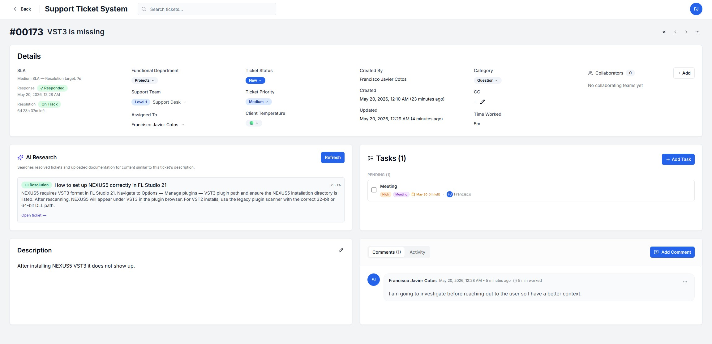

# MERA — Product Operations Platform

> An open-source, AI-native workspace for product operations teams. Tickets, SLAs, knowledge retrieval, and Scrum delivery — unified in a single system where the database is the source of truth.


<p align="center">
  
</p>

---

## What is MERA?

MERA is not a ticket tracker. It is a **product operations platform** — a place where customer-facing issues, institutional knowledge, and engineering delivery live in the same system, owned by the same teams, under the same access model.

Most ops teams operate across a fragmented stack: a ticketing tool, a chat thread, a tasks app, a knowledge wiki, and a project tracker that no one updates. Context lives in five places — none authoritative — and SLAs slip while leads spend their day reconstructing what happened.

**MERA closes that gap.** Every closed ticket feeds a searchable knowledge layer. Recurring issues become engineering work items in the same tool. SLAs are computed, not estimated. And when an agent opens a new case, an AI Research panel surfaces the most relevant past resolutions and documentation — automatically, with full source attribution.

> The flywheel: every resolved ticket makes the next one cheaper to solve, and patterns become roadmap items without switching tools.

---

## Core Surfaces

| Surface | What it does |
|---|---|
| **Tickets** | Full lifecycle — status, priority, temperature, SLA, rich-text resolution, realtime comments, immutable audit trail |
| **SLA Engine** | Per-priority response & resolution policies, auto-assigned on creation, pause/resume on customer-blocked statuses, computed at read time — no cron, no drift |
| **AI Knowledge Center** | Past resolutions + uploaded PDFs chunked and embedded via Gemini. Unified retrieval ranked by similarity, governed by admin-tunable weights and thresholds |
| **Projects & Scrum** | Projects, sprints, work items (epic / story / task / bug), drag-and-drop sprint board, backlog planning — same auth, same teams |

---

## AI Adoption — First-Class, Not a Feature

MERA was built AI-first, both as a product and as a project.

**In the product:**
- Every ticket close generates a 768-dim Gemini embedding via an edge function triggered by `pg_net` — no manual step, no queue
- An **AI Research panel** on every ticket embeds the query and runs `match_knowledge()` across ticket resolutions and KB documents in real time
- PDF ingestion pipeline: upload → edge function → `unpdf` extraction → chunking → Gemini batch embedding → `pgvector` — fully automated
- Retrieval is governed: similarity threshold, max results, per-source weights, per-document toggle — all admin-configurable, all audited

**In the codebase:**
- Built end-to-end with Claude Code and GitHub Copilot woven into the development workflow
- AI-assisted development is not hidden or apologized for — it's part of the thesis: this is what modern engineering looks like

```
Ticket closed → BEFORE trigger strips HTML → resolution_plain
             → AFTER trigger fires pg_net → embed-resolution edge fn
             → Gemini gemini-embedding-001 (768 dims)
             → resolution_embedding available to match_knowledge() RPC
             → AI Research panel surfaces it on the next relevant ticket
```

---

## Architecture

```
┌──────────────────────────────────────────────────────────────────┐
│                        Browser (React 19)                        │
│  Server Components  │  Client Components  │  TanStack Query      │
└────────────┬──────────────────────────┬───────────────────────── ┘
             │ Server Actions           │ Realtime WebSocket
             ▼                          ▼
┌──────────────────────────────────────────────────────────────────┐
│                     Next.js 16 (App Router)                      │
│  tickets · tasks · projects · knowledge · auth proxy middleware  │
└────────────┬──────────────────────────┬────────────────────────┬ ┘
             │ @supabase/ssr            │ Realtime               │ Storage
             ▼                          ▼                        ▼
┌──────────────────────────────────────────────────────────────────┐
│                        Supabase Platform                         │
│  Postgres 15 + RLS + Triggers │ Realtime (WS) │ Storage (S3)    │
│  pgvector · pg_net → edge fns │ per-ticket ch │ attachments/PDFs│
│                               │               │                  │
│  Edge Functions (Deno)                                           │
│    embed-resolution   — resolution → embedding on ticket close   │
│    ingest-document    — PDF → chunks → embeddings                │
│    embed-query        — query → embedding for retrieval          │
│         ↓  Google Gemini  gemini-embedding-001  (768 dims)       │
└──────────────────────────────────────────────────────────────────┘
```

**Key architectural decisions:**

| Decision | Why it matters |
|---|---|
| **Postgres triggers carry business logic** — history, SLA state, time accumulation, resolution validation | Application code is replaceable; the database is the contract. Invariants hold regardless of which client writes |
| **RLS as the security boundary** | Frontend checks are UX only. Stripping the UI must not strip access — auditable, declarative, lives next to the data |
| **Lookup tables, not enums** — status, priority, category, temperature are DB rows with color and display order | Adding a status is a row insert, not a deploy |
| **SLA status is a pure function** of stored timestamps — no cron, no recompute | Never wrong, never drifts, zero infrastructure overhead |
| **`pg_net` fans out to edge functions** | Keeps embeddings async without queue infrastructure |
| **Server Components first** — client islands only where stateful | Cheap server data fetches, no waterfall on the client |

---

## Stack

| Layer | Technology |
|---|---|
| Framework | **Next.js 16** — App Router, Server Actions, Server Components |
| UI | **React 19**, **shadcn/ui** + Radix, **Tailwind 3**, **Tiptap v3** |
| Language | **TypeScript 5** strict — `database.types.ts` is generated and authoritative |
| Data | **Supabase** — Postgres + Auth + Storage + Realtime + Edge Functions |
| Vector | **pgvector** (768-dim) + **Gemini `gemini-embedding-001`** |
| Forms | **react-hook-form** + **Zod** — schemas shared between client and server |
| Client cache | **TanStack Query v5** — used surgically for optimistic mutations |
| DnD | **@dnd-kit** — accessible drag-and-drop on sprint board |

---

## Quick Start

```bash
# 1. Clone & install
git clone https://github.com/<your-handle>/mera
cd mera && npm install        # Node >= 20

# 2. Environment
cp .env.example .env.local
#   NEXT_PUBLIC_SUPABASE_URL=https://<ref>.supabase.co
#   NEXT_PUBLIC_SUPABASE_ANON_KEY=...
#   SUPABASE_SERVICE_ROLE_KEY=...

# 3. Database
npx supabase link --project-ref <ref>
npx supabase db push          # applies all migrations in order
npx supabase db seed          # optional dev data

# 4. Edge functions (AI features)
npx supabase secrets set GEMINI_API_KEY=<your-key>
npx supabase functions deploy embed-resolution --project-ref <ref>
npx supabase functions deploy embed-query      --project-ref <ref>
npx supabase functions deploy ingest-document  --project-ref <ref>

# 5. Run
npm run dev                   # http://localhost:3000
```

Scripts: `npm run dev | build | start | lint`

---

## Contributing

MERA is open to collaboration. If you've stumbled across this project and feel like contributing — whether that's a bug report, a feature idea, a pull request, or just a thought — you're genuinely welcome here.

**Good places to start:**

- Browse open issues for `good first issue` labels
- Try the setup and report friction in the onboarding experience
- Pick anything from the roadmap below that excites you

**Development conventions (short version):**
- Data access only through `lib/supabase/queries/*` — never inline `.from(...)` in a component
- Every mutation validates with the matching Zod schema before touching Supabase
- Schema changes = new file under `supabase/migrations/` + regenerate `types/database.types.ts`
- History tables are read-only from app code — triggers write them
- Before "done": `npm run lint` clean + exercise the flow in a browser

Good software tends to grow from good conversations. Open an issue or reach out.

---

## Roadmap

- [ ] Hybrid retrieval (BM25 + vector) and reranking in `match_knowledge()`
- [ ] @mentions and threaded comment replies
- [ ] Email-in → ticket creation (parse + classify on ingest)
- [ ] Burndown / velocity / cycle-time analytics for Scrum
- [ ] Customer-facing portal (`role = 'client'`)
- [ ] Webhook integrations + outbound notifications (`integrations` table is already in place)
- [ ] Multi-tenant org boundary (currently single-org)
- [ ] Automated RLS policy regression tests in CI

---

## License

MIT © 2026 Francisco Javier Cotos — see [LICENSE.md](LICENSE.md)

MERA is a personal project built out of genuine curiosity and a desire to create something useful. It has no affiliation with any company or organization. The code is 100% AI-assisted — developed with Claude Code and GitHub Copilot woven into the workflow throughout. That's not a caveat; it's part of the point.
